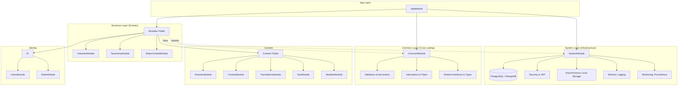

# 🚀 Mcitys API 3.0 | A scalable and modular REST API built with modern technologies

## The Mcitys project
This repository contains the back-end infrastructure of the [mcitys.com](https://mcitys.com/) website.
Mcitys is the structure that centralizes all the creations of Yves-Leonardo Marchon.
The front-end is a digital portfolio built with Angular. [See the repo](https://github.com/mcityscreations/mcs_angular/tree/main).
**Current Projects** 
- Migrate from MariaDB to PostgreSQL (In progress)
- Migrate Node.js/Express raw Javascript code to Nest.js/Typescript (processing)
- Launch the API on a dedicated VPS for better performances (testing)
- Connect the Mcitys API to the digital store mcitys.fr which is powered by Prestashop. (planned)

## 🏗️ Architecture philosophy

This new version of Mcitys API is built using the **Nest.js framework**. As systems grow, maintaining a clean architecture is crucial to avoid the pitfalls of **boilerplate code** and the monolithic structure that is often hard to maintain.

The transition to Nest.js was driven by a commitment to **robust, low-coupled architecture**. My first version (v1) of the API suffered from heavy interconnection, where changing one dependency initiated a cascade of updates throughout the codebase (a common beginner's mistake).

### 🎯 Key Architectural Drivers

The current architecture is built upon the following principles, largely enabled by Nest.js:

* **Inversion of Control (IoC) & Dependency Injection (DI):** Ensures a low-coupled design, making components easily interchangeable and testable.
* **TypeScript & Interfaces:** Guarantees strong typing and maintainability across the entire codebase.
* **Separation of Concerns (SoC):** The application is strictly divided into functional modules (Controllers, Services, Repositories). These modules are dispatched within three layers. The 'common' module stores cross-cutting types, validators and interceptors. The folder 'modules' contains all the business logic of the application. Finally, the module 'system' contains all the services that power the application (databases, metrics, security etc.)

* **Stateless Authentication:** Implementation of JWT-based security with decoupled RoleGuards, designed for seamless transition to microservices.

* **Enterprise Standards:** The framework facilitates the implementation of microservices architecture and enforces high code quality through tools like Prettier, ESLint and SonarQube.

**Goal:** To move beyond simply writing functional code, towards thinking like an architect who builds scalable, enterprise-grade applications.

This tiered approach ensures that the Business Layer remains lean and focused on domain logic, while infrastructure concerns are abstracted within the System Layer. This structure is the first step toward a seamless transition to a Microservices architecture.

### 🛡️ Resilience & Observability

To ensure high availability and maintainability, the API implements a multi-layered resilience strategy:

* **Advanced Error Management:** Using NestJS Global Filters, the system ensures that no unhandled exception can crash the process. Errors are intercepted, sanitized, and returned with standardized HTTP responses.

* **Distributed Tracing (Correlation IDs):** Every request is assigned a unique UUID (Correlation ID). This ID is propagated through all services and logs, allowing for seamless debugging across complex flows.

* **Hybrid Logging Strategy:** Real-time structured logs via Winston for immediate console feedback.

* **Persistence:** Critical logs and audit trails are indexed in MongoDB, enabling high-speed searches and historical analysis.

**Health Monitoring:** Implementation of the Prometheus metrics exporter to track system vitals (CPU, Memory, Request Latency), ready for Grafana visualization.

## 🛠️ Key technologies

| Role | Technology |
| :--- | :--- |
| **Framework** | Nest.js |
| **Language** | TypeScript |
| **Databases** | MariaDB -> PostgreSQL & MongoDB |
| **Containerizing** | Docker & Docker Compose |
| **Cache & Sessions** | Redis |
| **Frontend** | Angular |

## Database architecture
[Learn more](https://github.com/mcityscreations/mcs_api3/blob/main/src/database/postgresql/readme.md)
