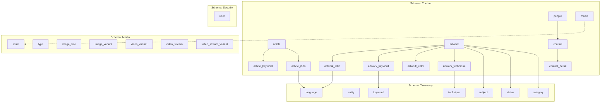

## Architectural choices with PostgreSQL
I wanted to apply the CQRS pattern (Command Query Responsibility Segregation) to preserve data integrity through a  normalized data structure and to simplify reading queries with the Materialized Views provided by Postgresql. The use of JSONB columns inside the Materialized Views bring order into complex views. Content is also indexable with GIN indexes which enables faster search queries. Materialized Views were chosen as once published, the content of my website mcitys.com evolves rarely and content is not added every second but rather once a week.

**Least privilege** The access to a given schema is limited to specific users only. This solution provides a new layer of security and also enable scalability as it prepares a future migration from a monolithic structure to a microservices architecture.

**Schemes**

